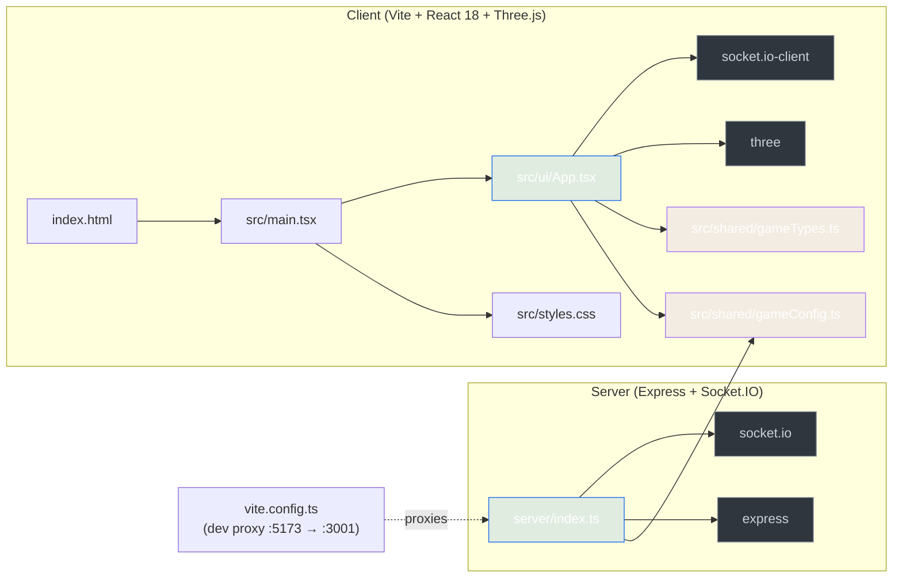
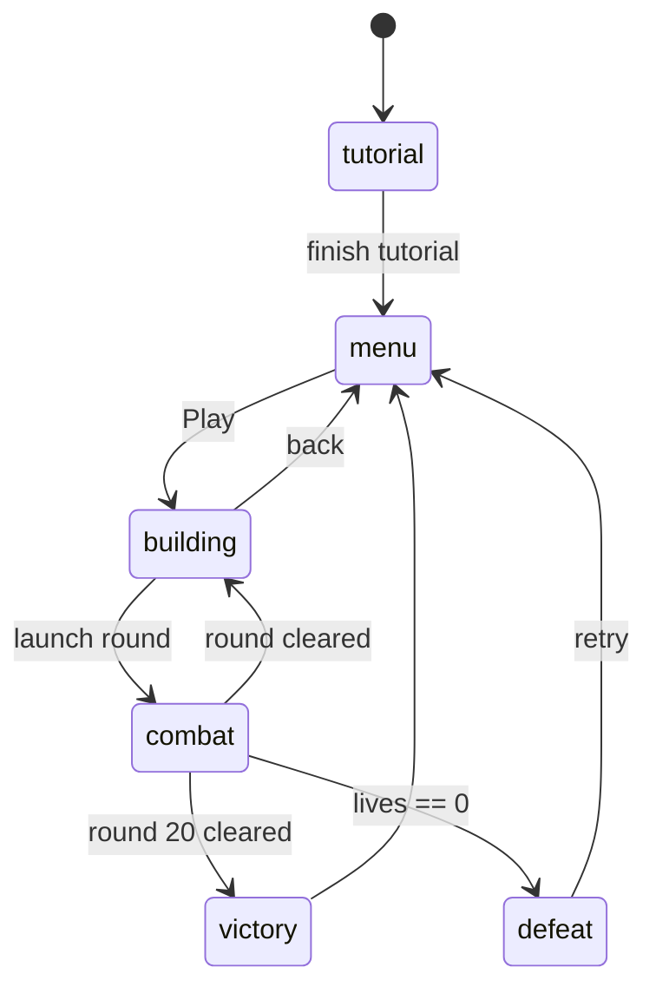

# FieldRunner CodeGraph

> A static, always-on knowledge map of this repo. Generated from the source by
> `.codegraph/scripts/build-static-graph.mjs` and consumed by humans, AI agents,
> and the optional DeepWiki-Open service (see `setup.md`).

## Overview

**FieldRunner** is a single-player tower-defense game built with React 18 +
Three.js on the client and Express + Socket.IO on the server. The codebase is
intentionally compact: **6 source files**, ~3 000 LOC total.

| Layer       | Tech                              | Entry point                |
| ----------- | --------------------------------- | -------------------------- |
| Renderer    | React 18 + Three.js 0.165 + Vite 5 | `src/main.tsx`             |
| Game UI/Logic | React hooks, refs, requestAnimationFrame | `src/ui/App.tsx`     |
| Shared config & types | TypeScript only (no runtime) | `src/shared/*`     |
| Backend     | Express 4 + Socket.IO 4 + Morgan  | `server/index.ts`          |

## Module Graph



## File-by-file map

### `index.html`
Single-document shell. Mounts `<div id="root">` and loads `/src/main.tsx` as an
ES module. No bundler-injected script tag — Vite handles it.

### `src/main.tsx`
Boots React 18 in `StrictMode`, imports global CSS, renders `<App />` into the
`#root` div. The smallest possible entry point.

### `src/styles.css`
Global stylesheet (not yet inspected in detail by this map — see
[DeepWiki-Open setup](setup.md) for an LLM-generated walkthrough).

### `src/shared/gameConfig.ts`
Pure data + tiny lookup helpers. No runtime side effects.

- `TowerKind`, `EnemyKind` — string-literal unions driving the whole game.
- `TowerConfig`, `EnemyConfig`, `RoundConfig` — gameplay tuning structs.
- `gameConfig` — the single source of truth: 8-node `path`, 16 `buildZones`,
  4 towers (cannon / rapid / splash / slow) with 3 upgrade levels each, 5 enemy
  types, 20 rounds generated procedurally.
- `getTowerConfig(kind)` / `getEnemyConfig(kind)` — non-null `Array.find`
  lookups (assert with `!`).

### `src/shared/gameTypes.ts`
Type-only module (no runtime). Declares the runtime entity records exchanged
between the React state and the Three.js scene:

- `TowerInstance`, `EnemyInstance`, `ProjectileInstance` — per-frame entity
  state.
- `SavedProgress` — `localStorage` payload.
- `BattlePhase` — `"menu" | "tutorial" | "building" | "combat" | "victory" | "defeat"`.
- `TelemetryEvent` — wire format for both REST and Socket.IO telemetry.

### `src/ui/App.tsx` (≈ 730 LOC)
The whole client. Single exported `App()` component + a few helpers.

```
App.tsx
├── localStorage helpers
│   ├── loadSave() / saveProgress()
│   └── usePersistedProgress()       (custom hook)
├── math helpers
│   ├── clamp(value, min, max)
│   ├── distance2D(ax, az, bx, bz)
│   └── makeId(prefix)
├── <App />                          ← state machine + scene wiring
│   ├── 16 useState / useRef slots
│   ├── useEffect: socket + canvas mount
│   ├── useFrame-style RAF loop (animationRef)
│   └── renders <Overlay /> + <canvas>
├── <Overlay />                      ← menu / tutorial / pause / end cards
└── createEngine()                   ← Three.js scene + asset setup
```

State flow at a glance:



### `server/index.ts`
A minimal Express + Socket.IO service in one file.

| Method | Path                | Purpose                                                |
| ------ | ------------------- | ------------------------------------------------------ |
| GET    | `/api/health`       | Liveness probe (`{ok: true, service: "tower-defense-api"}`) |
| GET    | `/api/config`       | Streams `gameConfig` straight from the shared module   |
| GET    | `/api/leaderboard`  | Top 10 leaderboard entries (in-memory)                 |
| POST   | `/api/leaderboard`  | Append a score, sorted desc                            |
| POST   | `/api/telemetry`    | Forward `event` to all Socket.IO clients + log it      |
| WS     | (Socket.IO)         | Emits `server:hello` on connect; logs `telemetry` events |

The dev Vite proxy (`vite.config.ts`) forwards `/api` and `/socket.io` from
port 5173 to this server on port 3001.

## Cross-cutting concepts

- **Source of truth for gameplay data** is `src/shared/gameConfig.ts` — used by
  both client and server. Edit it there, not in App.tsx.
- **State lives in `App.tsx`**. There is no Redux/Zustand/Context. Persistence
  is `localStorage` only; the server is stateless beyond an in-memory
  leaderboard.
- **Real-time channel** is Socket.IO, used for telemetry fan-out. Game state
  itself is not synchronized over the wire — this is a single-player game.
- **Rendering** is a single Three.js scene per `<canvas>`, updated by a
  `requestAnimationFrame` loop. No physics engine; collisions are 2D distance
  checks in `distance2D()`.

## How to keep this map fresh

1. Re-run the generator after significant refactors:

   ```bash
   node .codegraph/scripts/build-static-graph.mjs
   ```

2. For interactive Q&A, Mermaid diagrams, and a web UI, follow
   [`.codegraph/setup.md`](setup.md) to start the DeepWiki-Open service.
3. The DeepWiki-Open service keeps its own cache outside the project
   (`~/.adalflow/`), so the working tree stays clean.

## Limitations

- This static map only knows about *file-level* dependencies and *symbol-level*
  declarations; it does not index call sites or type usage. Use the
  DeepWiki-Open "Ask" tab for that.
- `src/styles.css` and the long body of `App.tsx` are summarised, not
  transcribed — open the source for full detail.
